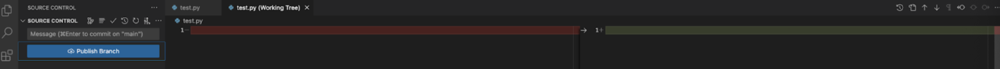
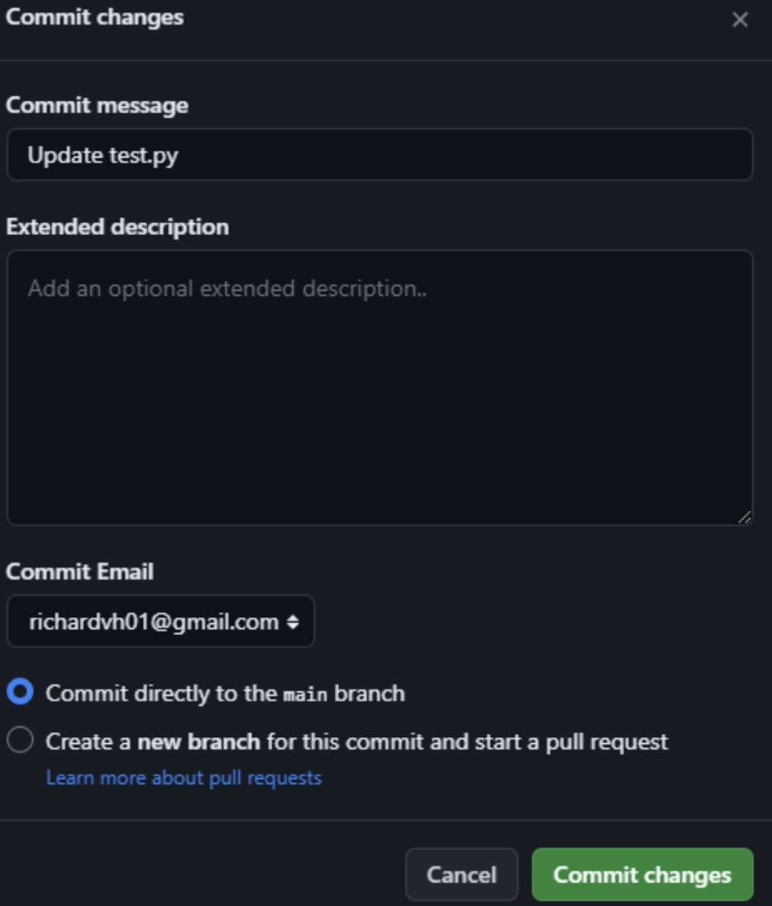

# Activity: Individual project creation
In this activity, the goal is to create a project using VSCode and config it following the instructions below.

1. At the beginning of Visual Studio Code, we can see that it shows us options with which we can clone a repository to be able to work with git.

    Whether on the left side we click on the sidebar and this shows us the source control option:

    Which we can access this option with the CTRL + SHIFT + G combination from Windows or CMD + G in Mac.
    

    Or also from the main panel we can see that option.
    

2. And if we open the application from a particular location (an already created folder) or click on “Open Folder” and select the folder we want to open, ask us if we want to initialize it.
    

3. Once the repository is initialized, we can see that certain commands that we can work with will be shown.
    

4. In the previous folder, there is a file of name test.py to exemplify the change in the interface by initializing the repository.Also from the explorer in VScode, we can notice certain changes:
    

    We can see that in the “Test.py” file a “U” letter appears, this means that we are not monitoring the changes we make (“Untracked”).When we begin to make modifications in our file and move on the changes, the letter will change to "m" ("modified").

5. From the Source Control area, at the top, we will see certain options to visualize, make Commit, update the view, or show more functionality (make push and pull among other things).We will also see a space where we are going to write the message that will help us record the changes we make.
    

6. When passing the cursor on the archives that record changes, we can see that some options appear, such as opening the file, ignoring the changes or passing the changes to the Stage area.
    

7. We can record the changes by clicking on the sign of "+", which means that we will add that file, clicking, the window will change again and we can see that a new letter "A" of "Added" now appears.
    

8. We can reverse those changes, clicking on the sign "-".
    

9. To record the changes, we need to write a message and then click Commit or type CTRL + ENTER or CMD + ENTER;As a good practice, the ideal is that the message is explanatory of what we are doing.
    

10. When modifying a file, we can see that this will appear again in the area of changes, but now with a letter "M" ("Modified").There are some extensions in VScode that allow us to see who was the person who made the changes in the document.
    

11. If we double click on the file, we can see the changes made on the right side to compare the previous version with the most recent.
    

12. Depending on what is being done, we can decide if we reject the changes, or accept them and add to the Stage area.
    

13. If we reject the changes, a dialog box will appear to ask for confirmation.
    
    And with this we return to the previous version of the file, which in this case was an empty file

    

14. If otherwise, we would have accepted the changes and made the ADS, we could visualize the history of the commits at the bottom.

    First we add the changes to Stage, add a message and click on Commit.
    

15. Then, in the viewer view, with the selected file, we click on Timeline and we can see the history of the commitments made:
    

16. Now, to connect git with github and add a remote repository, we will first create a repository in Github
    

17. Then what we will see is the repository route to access it via https
    

18. Now, in vscode, we put ourselves in Source Control and click on the 3 points, then remote and right away, in Add Remote.
    

19. And we are going to paste the repository route that we copy previously and click on "Add Remote From URL"
    

20. Next, VScode will ask us to give a name with which we will identify the repository, the standard is to call it `origin`.

21. Then, if we want to send our changes to the remote repository, we can click on the 3 points of Source Control, then in Pull, Push and then in Push or Push To.
    

    Y nos dará la opción de elegir nuestro repositorio remoto.
    

22. We click on our repository and we will see how the VSCODE screen starts updating.Then, in our Github account, when updating the page, we can see our reflected changes together with the messages we add
    

23. When we are working collaboratively, it is very common that there are changes in the remote repository that we must synchronize in our local environment.To simulate this behavior, we will modify the “Py ”file direct in Github, we simply select it and the option will appear to edit it
    

24. We add a message and make commit of these changes
    

25. Then we can see our commitment of commitments
    

26. This new version of the “Test.py” file is not found in our local repository, then we will pull them to our environment (Pull).Following a process similar to the one we did when we uploaded our changes, in the option of "Pull, Push", we click on "Pull From"
    

    And will show us the branches (branches) available 
    

27. Next, we will see that the changes were already reflected in our file
    

# Deliverable
The deliverable is the link of your repo in GitHub. This has to be sent to the Google form provided by the instructor.