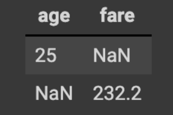
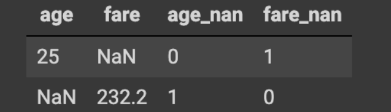
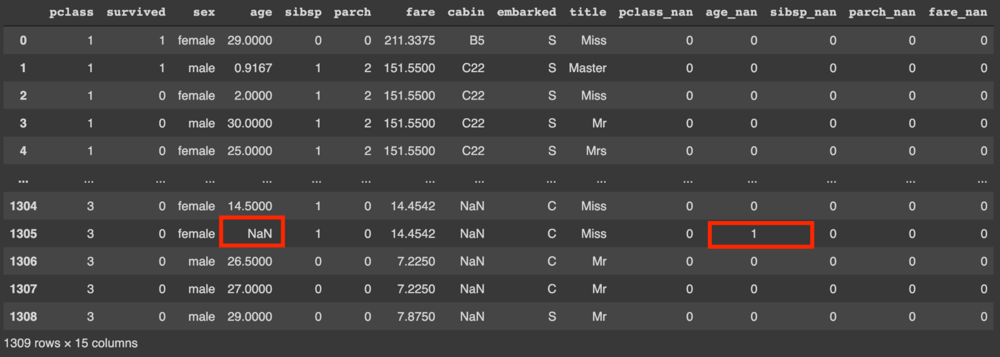

# Activity: Custom Transformer
Create a custom transformer that allows to double the columns and add to the end the text "`_nan`" to each name  (column title). Then identify missing or null data in each row.

Check the following steps:

1. Load the `raw-data.csv` file that contains the dataset in CSV format.
2. Read the Dataframe with Pandas.
3. Create your custom transformer that only identify null data in the numerical fields → `pclass, age, sibsp, parch, fare`.

    The number `1` represents missing data.

    * **Input example**:  
        Columns and rows with data without pre-process.

        
    * **Output example**:  
        Combination of input columns with columns that indicate missing data.
        

4. Place the name of the columns (transformer returns a numpy arrangement, that is, only numbers).
5. Print the results. This is a view of how they should see.

    

The red boxes indicate that a null value was found in the `age` field, and this was marked as 1 in the `age_nan` added field.

> **HINT**  
Use the [template](custom-transformer.py) Python script to create your transformer.