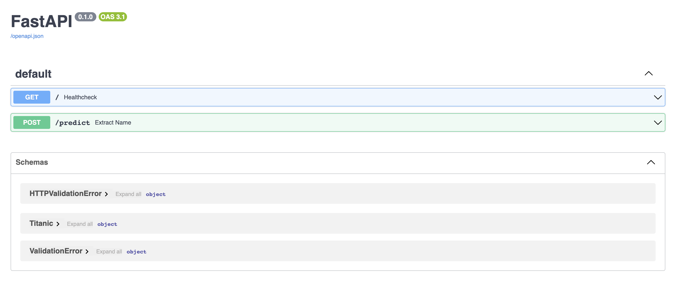

# REST API

This session is focused on giving an introduction to Rest API and the Fastapi Framework. It is explained how to migrate a project already referred to as a Rest API.

## Setup

* Change the directory to the `module-3/session-11/itesm_mlops/itesm_mlops` folder.

* Create a virtual environment with Python 3+:

    ```bash
    python3 -m venv venv
    ```

* Activate the virtual environment

    ```bash
    source venv/bin/activate
    ```

* Install the other libraries
Run the following command to install the libraries/packages.

    ```bash
    pip install -r requirements.txt
    ```

## Run FastAPI

* Run the next command to start the Titanic API locally

    ```bash
    uvicorn api.main:app --reload
    ```

## Checking endpoints

1. Access `http://127.0.0.1:8000/`, you will see a message like this `"Titanic is all ready to go!"`
2. Access `http://127.0.0.1:8000/docs`, the browser will display something like this:
    
3. Try running the following predictions with the endpoint by writing the following values:
    * **Prediction 1**  
        Request body

        ```bash
        {
        "pclass_nan": 0,
        "age_nan": 0,
        "sibsp_nan": 0,
        "parch_nan": 0,
        "fare_nan": 0,
        "sex_male": 1,
        "cabin_Missing": 1,
        "cabin_rare": 0,
        "embarked_Q": 1,
        "embarked_S": 0,
        "title_Mr": 1,
        "title_Mrs": 0,
        "title_rar": 0
        }
        ```

        Response body
        The output will be:

        ```bash
        "Resultado predicción: [0]"
        ```

    * **Prediction 2**  
        Request body

        ```bash
         {
            "pclass_nan": 0,
            "age_nan": 0,
            "sibsp_nan": 1,
            "parch_nan": 0,
            "fare_nan": 0,
            "sex_male": 0,
            "cabin_Missing": 0,
            "cabin_rare": 0,
            "embarked_Q": 1,
            "embarked_S": 0,
            "title_Mr": 1,
            "title_Mrs": 0,
            "title_rar": 0
        }
        ```

        Response body
        The output will be:

        ```bash
        "Resultado predicción: [1]"
        ```
