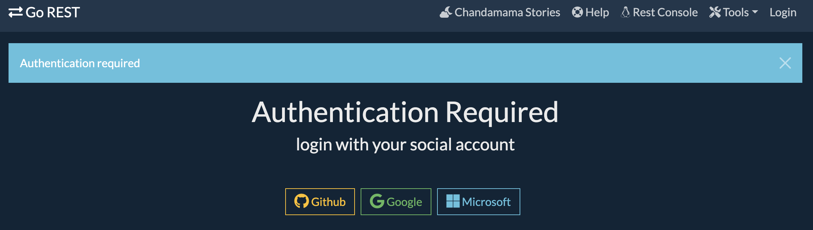
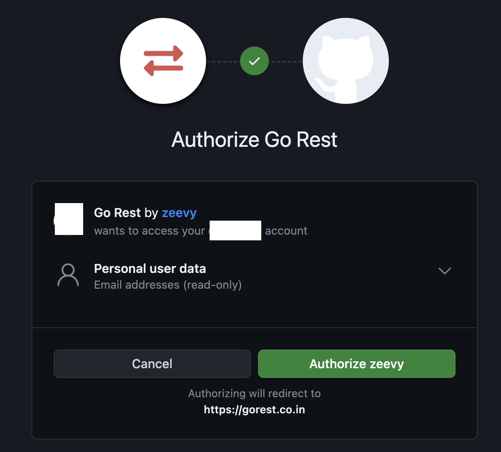
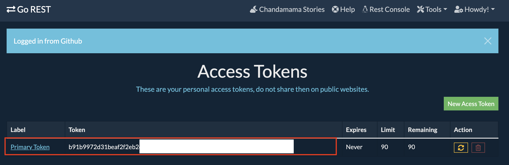

# Example REST API - Go REST
Go REST is a 24/7 online fake GraphQL and REST API service for quick testing and prototyping of web and android applications. Supports authentication, custom rate limiting, response format negotiation.

Access this [go-rest notebook](go-rest.ipynb) to check how the code below works.

## Authentication
1. Go to [GO REST](https://gorest.co.in/)  
2. Get your access tokens in [Authentication Required | GO REST](https://gorest.co.in/my-account/access-tokens)
    * Access the authentication and select your preferred login social account.
    
    * Authorize the access to your email
    
    * Get the token and copy it
    

## Example CURL  
cURL is a computer software project providing a library and command-line tool (curl) for transferring data using various network protocols. The name stands for "Client for URL".

> **IMPORTANT!**  
Remember to replace "YOUR-TOKEN-HERE" with your actual authorization token.

* **List users**
    ```bash
    curl -i -H "Accept:application/json" -H "Content-Type:application/json" -H "Authorization: Bearer YOUR-TOKEN-HERE" -XGET "https://gorest.co.in/public/v2/users"
    ```
* **Create user**
    ```bash
    curl -i -H "Accept:application/json" -H "Content-Type:application/json" -H "Authorization: Bearer YOUR-TOKEN-HERE" -XPOST "https://gorest.co.in/public/v2/users" -d '{"name":"Tenali Ramakrishna", "gender":"male", "email":"tenali.ramakrishna@15ce.com", "status":"active"}'
    ```
## Python Requests
Python Requests is a library that allows you to send HTTP requests using Python. You can use it to make GET, POST, PUT, PATCH, DELETE, or HEAD requests to any web server or web service and receive responses. You can also set headers and cookies with Python Requests. To use Python Requests, you need to import the requests module and use its methods with the URL of the web server.

> **IMPORTANT!**  
Remember to replace "YOUR-TOKEN-HERE" with your actual authorization token.
* **Update user**
    ```python
    import requests

    url = "https://gorest.co.in/public/v2/users/2481"
    headers = {
        "Accept": "application/json",
        "Content-Type": "application/json",
        "Authorization": "Bearer YOUR-TOKEN-HERE"
    }
    data = {
        "name": "Allasani Peddana",
        "email": "allasani.peddana@15ce.com",
        "status": "active"
    }

    response = requests.patch(url, headers=headers, json=data)

    print(response.status_code)
    print(response.text)
    ```
* **Delete user**
    ```python
    import requests

    url = "https://gorest.co.in/public/v2/users/2481"
    headers = {
        "Accept": "application/json",
        "Content-Type": "application/json",
        "Authorization": "Bearer YOUR-TOKEN-HERE"
    }

    response = requests.delete(url, headers=headers)

    print(response.status_code)
    print(response.text)
    ```


