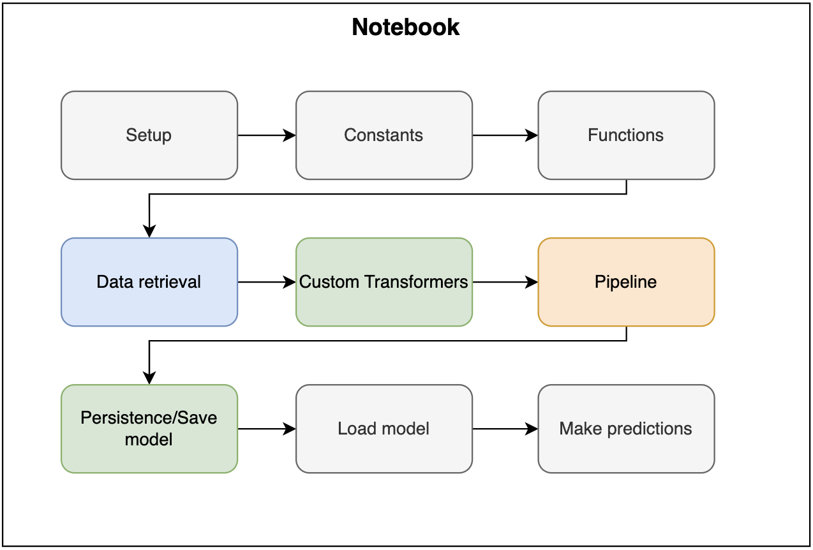
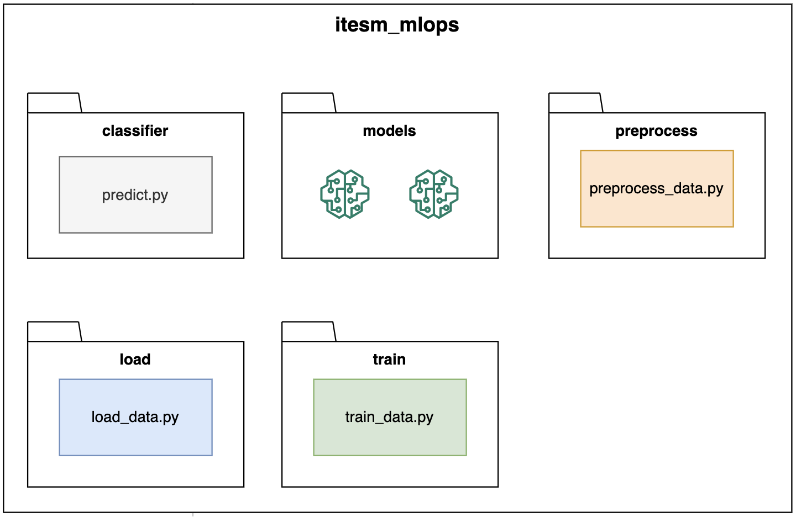

# Refactorization
Instructor: Carlos Mejia

This session talks about one of the most important practices to be able to climb an ML system: refactorization. Topics such as the directories structure of an ML system are included, the weaknesses that a notebook has to use in production, and a demo to refactorize an existing project.

## Setup
### Virtual environment

1. Create a virtual environment with `Python 3.10+`
    * Create venv
        ```bash
        python3.10 -m venv venv-session-9
        ```

    * Activate the virtual environment
        ```
        source venv-session-9/bin/activate
        ```


### Cookiecutter
1. Ensure you cover all the [prerrequisites](https://cookiecutter.readthedocs.io/en/stable/installation.html#prerequisites)
2. Install cookiecutter
    ```bash
    python -m pip install cookiecutter
    ```
3. If you are working in the forked or cloned `itesm-mlops` project, please change the working directory to the session 9 with this command. 
    ```bash
    cd module-3/session-9
    ```

    Otherwise, if you are working on a new project, just skip this step and go to the next one.
3. Run this command, and fill out the information
    ```bash
    cookiecutter https://github.com/audreyfeldroy/cookiecutter-pypackage.git
    ```
    After completing the steps, a new project called [itesm_mlops](itesm_mlops) is going to be created.

## Directory structure
Once the template is created, it is time to create the folders with the code following this structure:
1. Define the different sections of the notebook

2. Create the following folders with the scripts in it:

    > **IMPORTANT!**  
    Create the `__init__.py` scripts on each folder where there are python scripts since they are important to mark the folder as a package, that will be imported later.
3. Migrate the notebook code to the scripts.

## Usage
1. Change the directory to `itesm-mlops/module-3/session-9/itesm_mlops/itesm_mlops`.
2. Run `python itesm_mlops.py` in the terminal.

## Activity
Follow the instructions in the [github.md](activity/github.md) file to complete the activity.
