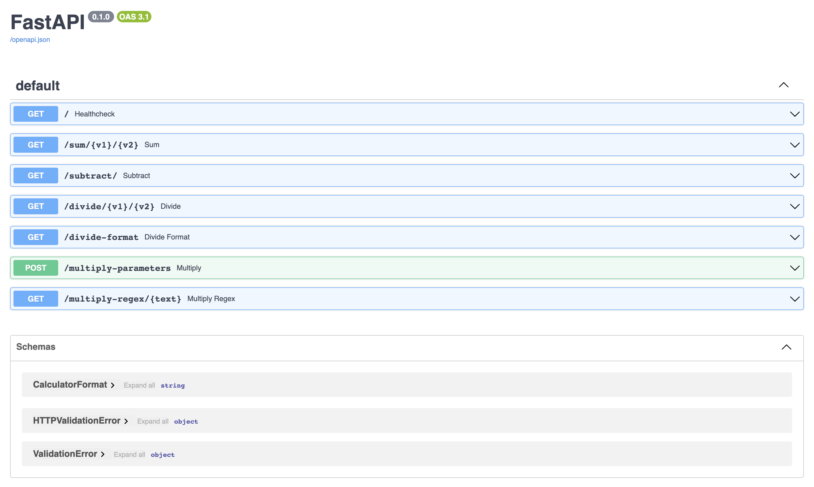
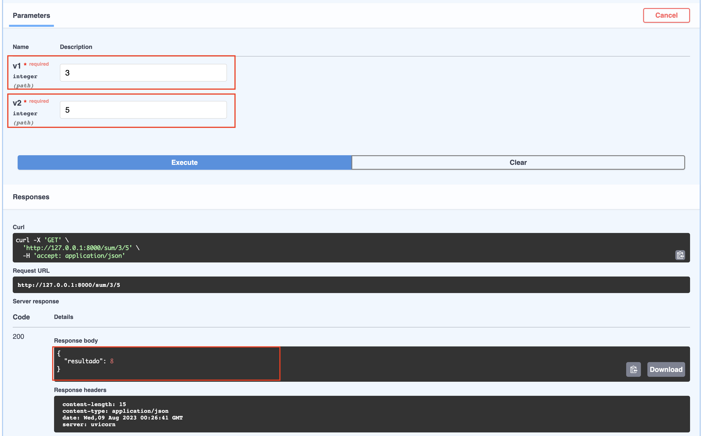

# Demo Calculator-Fast-API + Logging

In this demo, you will be able to deploy a simple calculator with 4 basic operations (+, -, * and /) using Fast API.

The Logging feature is also included, check the [main.py](src/main.py) module to inspect the logging code.

## Setup

* Create a virtual environment with:

    ```bash
    python3 -m venv venv
    ```

* Activate the virtual environment

    ```bash
    source venv/bin/activate
    ```

* Install the other libraries
Run the following command to install the libraries/packages.

    ```bash
    pip install -r requirements.txt
    ```

## Run FastAPI

* Change to the [demo_fast_api](.) directory
* Run next command to start calculator api locally

    ```bash
    uvicorn src.main:app --reload
    ```

## Checking endpoints

1. Access `http://127.0.0.1:8000/`, you will see a message like this `"Calculator is all ready to go!"`
2. A file called `main_fast_api.log` will be created automatically.
3. Access `http://127.0.0.1:8000/docs`, the browser will display something like this:
    
4. Open the [main_fast_api.log](main_fast_api.log) file and check a log saved similar to this:

    ```log
    2023-08-15 16:29:20,286:src.main:main:INFO:Healthy was checked.
    ```

5. Try running the sum endpoint by writing the values `3` and `5`, you will get the response body as follows

    **Response body**

    ```bash
    {
    "resultado": 8
    }
    ```

    

6. Open the [main_fast_api.log](main_fast_api.log) file again and check another log saved similar to this:

    ```log
    2023-08-15 16:29:20,286:src.main:main:INFO:Healthy was checked.
    2023-08-15 16:31:40,162:src.main:main:DEBUG:resultado sum: 11
    ```
